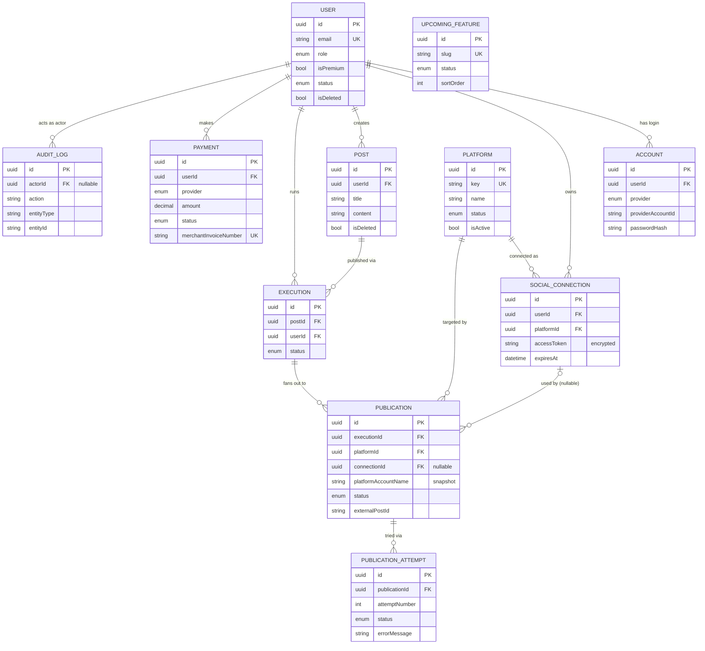

# Data Model — Content Automation Platform

**Version:** 1.0
**Date:** 2026-09-04
**Source of truth for product scope:** [`PRD.md`](./PRD.md)
**Status:** Agreed via interactive modeling session. This is the design of record; the
Prisma schema in Appendix A is the formal representation to drop into
`content-automation-backend/prisma/schema/` during implementation.

---

## 1. Design principles

These governed every decision below:

1. **Normalize for extensibility over compaction.** Where a choice was between a compact
   single-table shortcut and a normalized shape that extends cleanly, we chose normalized —
   the MVP is meant to grow into the full §16 feature set without reshaping.
2. **Backend is authoritative** (PRD §32 Rule 5). Premium status, payment verification, and
   auth state are never trusted from the client.
3. **Parent caches child rollup.** `execution.status` is computed from its publications;
   `publication.status` from its latest attempt; `user.isPremium` from a verified payment.
   The cache makes reads cheap; the children remain the source of truth.
4. **Typed common columns + a JSON escape hatch** for genuinely variant data
   (`social_connections.metadata`, `payments.gatewayResponse`) — instead of per-variant columns
   that cause schema churn.
5. **Soft-delete only true business data; hard-delete secrets; retire catalogue rows.**
6. **UUID primary keys everywhere** — unguessable, safe in public URLs (kills enumeration).

---

## 2. Decisions log

| # | Decision | Choice |
|---|---|---|
| 1 | Primary key type | **UUID** on every table |
| 2 | Login methods | User + separate **`accounts`** table (one row per provider) |
| 3 | Same email via new provider | **Auto-link on verified email**; `email` unique on `users` |
| 4 | Roles | `role` enum `{ USER, ADMIN, SUPER_ADMIN }`, default USER |
| 5 | Premium | `isPremium` + `premiumSince`, backend-set (flag = cache) |
| 6 | Lifecycle | `isDeleted`/`deletedAt` + `status {ACTIVE, BLOCKED}`; email **reserved** on delete |
| 7 | Users/accounts shape | finalized (§4) |
| 8 | Social connections | one **polymorphic** table; `platformId` FK; tokens **encrypted** |
| 9 | Disconnect | **hard-delete**; `@@unique([userId, platformId])`; publication snapshots identity |
| 10 | Posts | `title?` + `content` + optional image; **immutable**; soft-delete |
| 11 | Platforms | **admin-managed `platforms` table**; `key` drives code; `status` LIVE/COMING_SOON |
| 12 | Execution / Publication | stored+computed `execution.status`; `externalPostUrl` included |
| 13 | Retry | normalized **attempts ledger** (`execution → publication → publication_attempts`) |
| 14 | Payments | provider-agnostic ledger; **bKash sandbox** (per reference); Plan/Sub/Refunds deferred |
| 15 | Upcoming features | admin-managed catalogue; url+publicId image convention |
| 16 | Cross-cutting | generic **`audit_logs`**; timestamp/soft-delete/index conventions |

---

## 3. The cast (sample data used throughout)

| user | id | signed up via | role | premium |
|---|---|---|---|---|
| **Alice** | `u_alice` | email + password | USER | no |
| **Bob** | `u_bob` | Google | USER | yes |
| **Owner** | `u_admin` | email + password | SUPER_ADMIN | no |

Every connection, post, execution, and payment hangs off one of these users. **Golden rule
(PRD §23):** a user may never read another user's data.

---

## 4. Entities

### 4.1 `users`

| field | type | notes |
|---|---|---|
| id | UUID (PK) | |
| name | String | required |
| email | String, **unique** | person identity; reserved after soft-delete |
| emailVerified | Boolean = false | gate for auto-linking + login |
| avatarUrl | String? | Cloudinary secure URL |
| avatarPublicId | String? | Cloudinary id (replace/delete old) |
| role | Role = USER | `{ USER, ADMIN, SUPER_ADMIN }` |
| isPremium | Boolean = false | backend-set cache of a verified payment |
| premiumSince | DateTime? | |
| status | UserStatus = ACTIVE | `{ ACTIVE, BLOCKED }` (moderation) |
| isDeleted | Boolean = false | soft delete |
| deletedAt | DateTime? | |
| createdAt / updatedAt | DateTime | |

Relations: `accounts[]`, `socialConnections[]`, `posts[]`, `executions[]`, `payments[]`,
`auditLogs[]` (as actor).

### 4.2 `accounts` — auth identities (one per login method)

| field | type | notes |
|---|---|---|
| id | UUID (PK) | |
| userId | UUID FK → users | cascade |
| provider | AuthProvider | `{ CREDENTIALS, GOOGLE }` (add FACEBOOK/GITHUB later) |
| providerAccountId | String | Google `sub` for GOOGLE; email for CREDENTIALS |
| passwordHash | String? | only for CREDENTIALS |
| createdAt / updatedAt | DateTime | |

Constraints: `@@unique([provider, providerAccountId])`, `@@unique([userId, provider])`.
**Stores identity only — no Google OAuth tokens** (login just verifies the ID token).

**Auto-link example** — Alice (credentials) later signs in with Google using `alice@example.com`:
one `users` row, two `accounts`:

| id | userId | provider | providerAccountId | passwordHash |
|---|---|---|---|---|
| ac_1 | u_alice | CREDENTIALS | alice@example.com | `$2b$…` |
| ac_2 | u_alice | GOOGLE | google_sub_123 | `null` |

### 4.3 `platforms` — admin-managed publishing targets (§11)

| field | type | notes |
|---|---|---|
| id | UUID (PK) | |
| key | String, **unique** | slug (`linkedin`, `facebook`) — **code switches on this** |
| name | String | admin-editable display name |
| logoUrl | String? | admin upload (Cloudinary) |
| logoPublicId | String? | |
| status | PlatformStatus = COMING_SOON | `{ LIVE, COMING_SOON }` — LIVE = real integration |
| isActive | Boolean = true | admin show/hide toggle |
| sortOrder | Int = 0 | order in the picker |
| createdAt / updatedAt | DateTime | |

Never hard-deleted (retire via `isActive = false`), so downstream FKs stay valid forever.

| id | key | name | status | isActive | sortOrder |
|---|---|---|---|---|---|
| pl_li | linkedin | LinkedIn | LIVE | true | 1 |
| pl_fb | facebook | Facebook Page | LIVE | true | 2 |
| pl_ig | instagram | Instagram | COMING_SOON | true | 3 |

### 4.4 `social_connections` — a user's connected account per platform (§8)

| field | type | notes |
|---|---|---|
| id | UUID (PK) | |
| userId | UUID FK → users | cascade |
| platformId | UUID FK → platforms | |
| platformAccountId | String? | LinkedIn member URN / Facebook Page ID |
| platformAccountName | String? | "Alice Rahman" / "Alice's Studio" |
| accessToken | String 🔒 | **encrypted at rest** (AES-256-GCM); never returned to client |
| refreshToken | String? 🔒 | encrypted |
| expiresAt | DateTime? | |
| metadata | Json? | platform-variant extras (scope, Page category, user-token expiry) |
| createdAt / updatedAt | DateTime | |

Constraints: `@@unique([userId, platformId])` (one connection per platform, MVP).
**Hard-deleted on disconnect** (removes the live secret); history survives via publication snapshot.

### 4.5 `posts` — content (§9)

| field | type | notes |
|---|---|---|
| id | UUID (PK) | |
| userId | UUID FK → users | cascade |
| title | String? | internal label (Executions list); social posts have no title |
| content | String | required (non-empty at validation layer) |
| imageUrl | String? | one optional image (Cloudinary) |
| imagePublicId | String? | |
| isDeleted | Boolean = false | soft delete (keeps execution history readable) |
| deletedAt | DateTime? | |
| createdAt / updatedAt | DateTime | |

**Immutable** (no edit endpoint) → the content shown in history is always exactly what was
published; platform selection is **not** here — it lives on the publish action.

### 4.6 `executions` — one "Publish Now" run (§10–14)

| field | type | notes |
|---|---|---|
| id | UUID (PK) | |
| postId | UUID FK → posts | |
| userId | UUID FK → users | |
| status | ExecutionStatus = PENDING | **stored, computed by worker** from publications |
| startedAt | DateTime? | |
| completedAt | DateTime? | |
| createdAt / updatedAt | DateTime | |

Status derivation: all SUCCESS → COMPLETED · some SUCCESS + some FAILED → PARTIALLY_COMPLETED ·
all FAILED → FAILED · any RUNNING/PENDING → RUNNING.

### 4.7 `publications` — per-platform target + current state

| field | type | notes |
|---|---|---|
| id | UUID (PK) | |
| executionId | UUID FK → executions | cascade |
| platformId | UUID FK → platforms | |
| connectionId | UUID? FK → social_connections | **`onDelete: SetNull`** (connection may be hard-deleted) |
| platformAccountName | String? | **snapshot** — keeps history readable after disconnect |
| status | PublicationStatus = PENDING | cache of latest attempt |
| externalPostId | String? | live post id, promoted from the winning attempt |
| externalPostUrl | String? | permalink, if the API returns one |
| publishedAt | DateTime? | |
| createdAt / updatedAt | DateTime | |

Constraints: `@@unique([executionId, platformId])` (a platform appears once per run).

### 4.8 `publication_attempts` — the retry ledger (§13)

| field | type | notes |
|---|---|---|
| id | UUID (PK) | |
| publicationId | UUID FK → publications | cascade |
| attemptNumber | Int | 1 = first publish (not just retries) |
| status | AttemptStatus | `{ RUNNING, SUCCESS, FAILED }` |
| errorMessage | String? | latest FAILED reason surfaces on the detail page |
| externalPostId | String? | set on success |
| externalPostUrl | String? | |
| startedAt / finishedAt | DateTime? | |
| createdAt | DateTime | append-only (no updatedAt) |

Constraints: `@@unique([publicationId, attemptNumber])`. `retryCount` is **derived**
(`max(attemptNumber) − 1`). Future auto-retry/backoff/DLQ = additive columns here, no reshaping.

**Retry example** — `pub_2` (Facebook) fails, Alice reconnects, retries:

| attempt | status | errorMessage | | publication after |
|---|---|---|---|---|
| at_1 (#1) | FAILED | "Facebook token expired" | | status FAILED |
| at_2 (#2) | SUCCESS | `null` | → | status **SUCCESS**, externalPostId `fb_987`, connectionId re-bound to current |

### 4.9 `payments` — provider-agnostic financial ledger (§15)

| field | type | notes |
|---|---|---|
| id | UUID (PK) | |
| userId | UUID FK → users | |
| provider | PaymentProvider = BKASH | `{ BKASH }` (add STRIPE/SSLCOMMERZ later) |
| purpose | PaymentPurpose = PREMIUM_UPGRADE | extensibility hook |
| amount | Decimal(10,2) | recorded per row (not from env) |
| currency | String = "BDT" | |
| status | PaymentStatus = PENDING | `{ PENDING, SUCCESS, FAILED, CANCELLED }` |
| merchantInvoiceNumber | String, **unique** | our order ref (idempotency) |
| providerPaymentId | String?, **unique** | gateway session/payment id |
| providerTransactionId | String?, **unique** | set on success |
| payerReference | String? | e.g. bKash payer ref |
| gatewayResponse | Json? | raw provider payload (audit) |
| paidAt | DateTime? | |
| createdAt / updatedAt | DateTime | |

**Payment = bKash tokenized SANDBOX** (per the PH-Healthcare reference) — test/dummy money, not
real. Schema is identical for a real merchant account; going live is an env/config swap only.

On verified `SUCCESS`, backend sets `user.isPremium = true`, `premiumSince = now`.
**Payment history** = `payments WHERE userId = me` ordered by `createdAt` desc — shows provider,
purpose, amount, currency, status (incl. failures/cancellations), and date.

### 4.10 `upcoming_features` — premium roadmap catalogue (§16/§17)

| field | type | notes |
|---|---|---|
| id | UUID (PK) | |
| slug | String, **unique** | drives `/upcoming-features/:slug` |
| title | String | |
| shortDescription | String | card text |
| description | String | detailed text |
| imageUrl | String? | Cloudinary |
| imagePublicId | String? | |
| status | UpcomingFeatureStatus = COMING_SOON | `{ COMING_SOON, IN_DEVELOPMENT, PLANNED }` |
| sortOrder | Int = 0 | |
| isPremiumVisible | Boolean = true | admin lever to tease non-premium users |
| createdAt / updatedAt | DateTime | |

Admin-managed (CRUD). Premium gating enforced at the route (`auth` + `requirePremium`), not schema.

### 4.11 `audit_logs` — append-only sensitive-action log

| field | type | notes |
|---|---|---|
| id | UUID (PK) | |
| actorId | UUID? FK → users | `onDelete: SetNull`; null = system |
| action | String | e.g. `PREMIUM_GRANTED`, `USER_BLOCKED`, `CONNECTION_DISCONNECTED` |
| entityType | String | e.g. `User`, `Payment`, `Platform` |
| entityId | String? | affected row id |
| metadata | Json? | before/after, details |
| ipAddress | String? | |
| userAgent | String? | |
| createdAt | DateTime | append-only |

Generic `entityType`/`entityId` + `metadata` → log anything without new tables.

---

## 5. Relationships (ERD)



---

## 6. Conventions

| concern | rule |
|---|---|
| **Primary keys** | UUID everywhere (`@default(uuid())`) |
| **Timestamps** | `createdAt` + `updatedAt` on mutable tables; append-only tables (`publication_attempts`, `audit_logs`) get `createdAt` only |
| **Soft-delete** | **only** `users` + `posts`. Connections **hard-delete**; platforms/features **retire** via `isActive`/`status`; executions/publications/attempts/payments/audit = immutable history |
| **Images** | always a `…Url` + `…PublicId` pair (avatar, platform logo, post image, feature image) |
| **Secrets** | `accessToken`/`refreshToken` encrypted at rest; never serialized to clients (PRD §22) |
| **Indexes** | every FK; plus `(userId, createdAt)` on `posts`, `executions`, `payments` for history lists; `@@unique` guards as listed per table |
| **Status caching** | parent stores rolled-up status computed from children (`execution` ← `publications` ← `attempts`; `user.isPremium` ← verified `payment`) |

---

## 7. Deferred (structured for, not built in MVP)

| future capability | how the model absorbs it |
|---|---|
| More providers (Stripe/SSLCommerz) | new `PaymentProvider` enum value + `gatewayResponse` JSON |
| More platforms (Instagram/X/…) | new `platforms` row (admin) + a registered publisher for its `key` |
| More login providers (Facebook/GitHub) | new `AuthProvider` value + new `accounts` rows |
| Subscriptions / plans / tiers | `payments.purpose` + amount-per-row ready; add `Plan`/`Subscription` tables later |
| Refunds | future `refunds` table → `paymentId` (partial/multiple) |
| Auto-retry / backoff / DLQ | additive columns on `publication_attempts` |
| Per-user platform visibility | future `user_platform_preferences` join table |
| Editable workflow builder (§16.12) | future `workflow` / `workflow_node` tables; today the graph is derived |

---

## Appendix A — Prisma schema (formal representation)

> Multi-file layout under `prisma/schema/`, matching the reference project. Split into files as
> shown, or keep together. `generator`/`datasource` already exist in `schema.prisma`.

```prisma
// enums.prisma
enum Role { SUPER_ADMIN ADMIN USER }
enum UserStatus { ACTIVE BLOCKED }
enum AuthProvider { CREDENTIALS GOOGLE }
enum PlatformStatus { LIVE COMING_SOON }
enum ExecutionStatus { PENDING RUNNING PARTIALLY_COMPLETED COMPLETED FAILED }
enum PublicationStatus { PENDING RUNNING SUCCESS FAILED }
enum AttemptStatus { RUNNING SUCCESS FAILED }
enum PaymentProvider { BKASH }
enum PaymentPurpose { PREMIUM_UPGRADE }
enum PaymentStatus { PENDING SUCCESS FAILED CANCELLED }
enum UpcomingFeatureStatus { COMING_SOON IN_DEVELOPMENT PLANNED }

// user.prisma
model User {
  id            String     @id @default(uuid())
  name          String
  email         String     @unique
  emailVerified Boolean    @default(false)
  avatarUrl     String?
  avatarPublicId String?
  role          Role       @default(USER)
  isPremium     Boolean    @default(false)
  premiumSince  DateTime?
  status        UserStatus @default(ACTIVE)
  isDeleted     Boolean    @default(false)
  deletedAt     DateTime?
  createdAt     DateTime   @default(now())
  updatedAt     DateTime   @updatedAt

  accounts          Account[]
  socialConnections SocialConnection[]
  posts             Post[]
  executions        Execution[]
  payments          Payment[]
  auditLogs         AuditLog[]

  @@index([isDeleted])
  @@map("users")
}

// account.prisma
model Account {
  id                String       @id @default(uuid())
  userId            String
  provider          AuthProvider
  providerAccountId String
  passwordHash      String?
  createdAt         DateTime     @default(now())
  updatedAt         DateTime     @updatedAt

  user User @relation(fields: [userId], references: [id], onDelete: Cascade)

  @@unique([provider, providerAccountId])
  @@unique([userId, provider])
  @@index([userId])
  @@map("accounts")
}

// platform.prisma
model Platform {
  id           String         @id @default(uuid())
  key          String         @unique
  name         String
  logoUrl      String?
  logoPublicId String?
  status       PlatformStatus @default(COMING_SOON)
  isActive     Boolean        @default(true)
  sortOrder    Int            @default(0)
  createdAt    DateTime       @default(now())
  updatedAt    DateTime       @updatedAt

  connections  SocialConnection[]
  publications Publication[]

  @@map("platforms")
}

// socialConnection.prisma
model SocialConnection {
  id                  String    @id @default(uuid())
  userId              String
  platformId          String
  platformAccountId   String?
  platformAccountName String?
  accessToken         String
  refreshToken        String?
  expiresAt           DateTime?
  metadata            Json?
  createdAt           DateTime  @default(now())
  updatedAt           DateTime  @updatedAt

  user     User     @relation(fields: [userId], references: [id], onDelete: Cascade)
  platform Platform @relation(fields: [platformId], references: [id])

  @@unique([userId, platformId])
  @@index([userId])
  @@map("social_connections")
}

// post.prisma
model Post {
  id            String   @id @default(uuid())
  userId        String
  title         String?
  content       String
  imageUrl      String?
  imagePublicId String?
  isDeleted     Boolean  @default(false)
  deletedAt     DateTime?
  createdAt     DateTime @default(now())
  updatedAt     DateTime @updatedAt

  user       User        @relation(fields: [userId], references: [id], onDelete: Cascade)
  executions Execution[]

  @@index([userId, createdAt])
  @@map("posts")
}

// execution.prisma
model Execution {
  id          String          @id @default(uuid())
  postId      String
  userId      String
  status      ExecutionStatus @default(PENDING)
  startedAt   DateTime?
  completedAt DateTime?
  createdAt   DateTime        @default(now())
  updatedAt   DateTime        @updatedAt

  post         Post          @relation(fields: [postId], references: [id])
  user         User          @relation(fields: [userId], references: [id], onDelete: Cascade)
  publications Publication[]

  @@index([userId, createdAt])
  @@index([postId])
  @@map("executions")
}

// publication.prisma
model Publication {
  id                  String            @id @default(uuid())
  executionId         String
  platformId          String
  connectionId        String?
  platformAccountName String?
  status              PublicationStatus @default(PENDING)
  externalPostId      String?
  externalPostUrl     String?
  publishedAt         DateTime?
  createdAt           DateTime          @default(now())
  updatedAt           DateTime          @updatedAt

  execution  Execution         @relation(fields: [executionId], references: [id], onDelete: Cascade)
  platform   Platform          @relation(fields: [platformId], references: [id])
  connection SocialConnection? @relation(fields: [connectionId], references: [id], onDelete: SetNull)
  attempts   PublicationAttempt[]

  @@unique([executionId, platformId])
  @@index([executionId])
  @@map("publications")
}

// publicationAttempt.prisma
model PublicationAttempt {
  id              String        @id @default(uuid())
  publicationId   String
  attemptNumber   Int
  status          AttemptStatus
  errorMessage    String?
  externalPostId  String?
  externalPostUrl String?
  startedAt       DateTime?
  finishedAt      DateTime?
  createdAt       DateTime      @default(now())

  publication Publication @relation(fields: [publicationId], references: [id], onDelete: Cascade)

  @@unique([publicationId, attemptNumber])
  @@index([publicationId])
  @@map("publication_attempts")
}

// payment.prisma
model Payment {
  id                    String          @id @default(uuid())
  userId                String
  provider              PaymentProvider @default(BKASH)
  purpose               PaymentPurpose  @default(PREMIUM_UPGRADE)
  amount                Decimal         @db.Decimal(10, 2)
  currency              String          @default("BDT")
  status                PaymentStatus   @default(PENDING)
  merchantInvoiceNumber String          @unique
  providerPaymentId     String?         @unique
  providerTransactionId String?         @unique
  payerReference        String?
  gatewayResponse       Json?
  paidAt                DateTime?
  createdAt             DateTime        @default(now())
  updatedAt             DateTime        @updatedAt

  user User @relation(fields: [userId], references: [id])

  @@index([userId, createdAt])
  @@map("payments")
}

// upcomingFeature.prisma
model UpcomingFeature {
  id               String                @id @default(uuid())
  slug             String                @unique
  title            String
  shortDescription String
  description      String
  imageUrl         String?
  imagePublicId    String?
  status           UpcomingFeatureStatus @default(COMING_SOON)
  sortOrder        Int                   @default(0)
  isPremiumVisible Boolean               @default(true)
  createdAt        DateTime              @default(now())
  updatedAt        DateTime              @updatedAt

  @@map("upcoming_features")
}

// auditLog.prisma
model AuditLog {
  id         String   @id @default(uuid())
  actorId    String?
  action     String
  entityType String
  entityId   String?
  metadata   Json?
  ipAddress  String?
  userAgent  String?
  createdAt  DateTime @default(now())

  actor User? @relation(fields: [actorId], references: [id], onDelete: SetNull)

  @@index([entityType, entityId])
  @@index([actorId])
  @@map("audit_logs")
}
```
